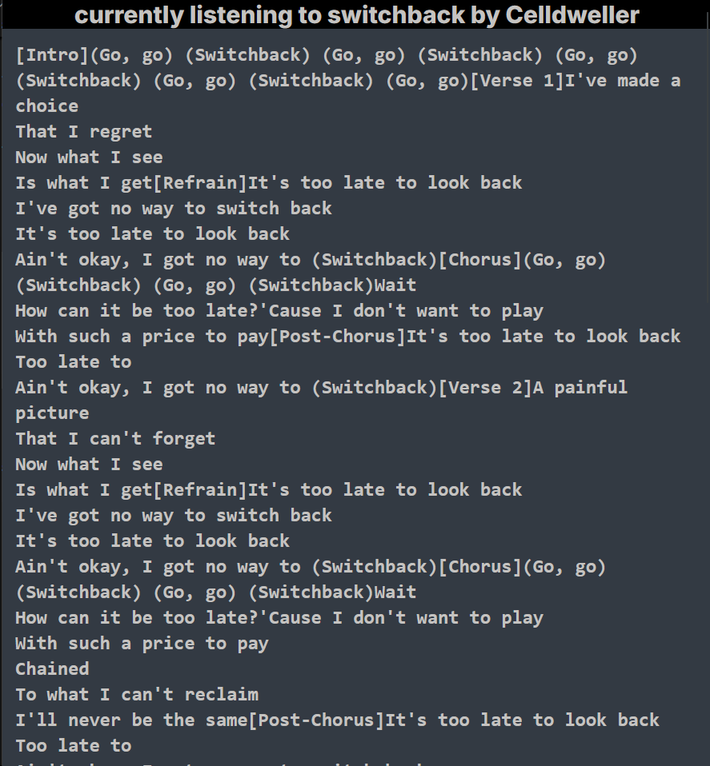

This is a [Next.js](https://nextjs.org/) project bootstrapped with [`create-next-app`](https://github.com/vercel/next.js/tree/canary/packages/create-next-app).

## Getting Started

First, run the development server:

```bash
npm run dev
# or
yarn dev
# or
pnpm dev
# or
bun dev
```

Open [http://localhost:3000](http://localhost:3000) with your browser to see the result.

You can start editing the page by modifying `app/page.tsx`. The page auto-updates as you edit the file.

This project uses [`next/font`](https://nextjs.org/docs/basic-features/font-optimization) to automatically optimize and load Inter, a custom Google Font.

this project has two parts-

1. a page where user can ask for a song's lyrics with song name and artist and a scraper fetches it
2. a spotify sync page where users can authenticate themselves and authorize my spotify app by initiating authorization flow with pkce. This works like this :
   my server creates a code verifier and hashes it and makes a code challenge.
   codeverifier is stored in cookie. an authorization url is created then my web app redirects it to spotify's authentication page and authorization page with the my client id, response type, redirect url, state, scope, code challenge, and code challenge method i.e sha256
   my app recieves the callback and then makes a post request to spotify's token endpoint and then spotify sends an access token and a refresh token back
3. the users are then redirected to a page where the lyrics of the song they are currently listening to is fetched and displayed from the lyrics fetching endpoint

### currently deployed at https://deez-f8ol-thetempest76s-projects.vercel.app/


